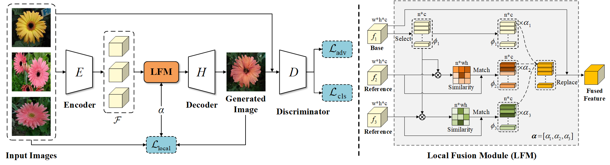

# LoFGAN-pytorch

The official pytorch implementation of our paper LoFGAN: Fusing Local Representations for Few-shot Image Generation, ICCV 2021.




> LoFGAN: Fusing Local Representations for Few-shot Image Generation
> 
> Zheng Gu, Wenbin Li, Jing Huo, Lei Wang, and Yang Gao
> 
> [Paper](https://openaccess.thecvf.com/content/ICCV2021/papers/Gu_LoFGAN_Fusing_Local_Representations_for_Few-Shot_Image_Generation_ICCV_2021_paper.pdf)

## Prerequisites
- Pytorch 1.5

## Preparing Dataset
Download the [datasets](https://drive.google.com/drive/folders/1nGIqXPEjyhZjIsgiP_-Rb5t6Ji8RdiCA?usp=sharing) and unzip them in `datasets` folder.

## Training
```shell
python train.py --conf configs/flower_lofgan.yaml \
--output_dir results/flower_lofgan \
--gpu 0
```

* You may also customize the parameters in `configs`.
* It takes about 30 hours to train the network on a V100 GPU.


## Testing
```shell
python test.py --name results/flower_lofgan --gpu 0
```

The generated images will be saved in `results/flower_lofgan/test`.


## Evaluation
```shell
python main_metric.py --gpu 0 --dataset flower \
--name results/flower_lofgan \
--real_dir datasets/for_fid/flower --ckpt gen_00100000.pt \
--fake_dir test_for_fid
```

## Citation
If you use this code for your research, please cite our paper.

    @inproceedings{gu2021lofgan,
    title={LoFGAN: Fusing Local Representations for Few-Shot Image Generation},
    author={Gu, Zheng and Li, Wenbin and Huo, Jing and Wang, Lei and Gao, Yang},
    booktitle={Proceedings of the IEEE/CVF International Conference on Computer Vision},
    pages={8463--8471},
    year={2021}
    }


## Acknowledgement
Our code is designed based on [FUNIT](https://github.com/NVlabs/FUNIT).

The code for calculate FID is based on [pytorch-fid](https://github.com/mseitzer/pytorch-fid)